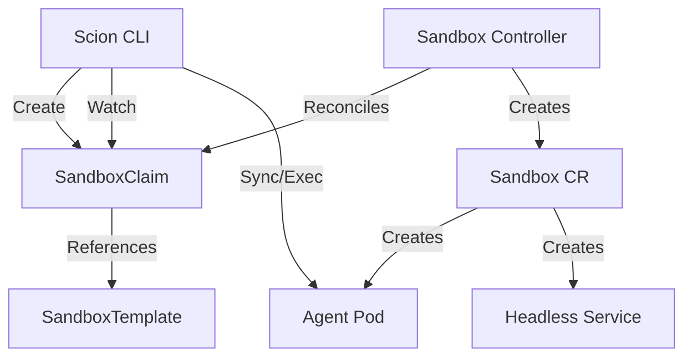

# Kubernetes Runtime with Agent Sandbox Design

## Overview
This document outlines the design for implementing the Kubernetes Runtime for `scion-agent` using the `agent-sandbox` standard (https://github.com/kubernetes-sigs/agent-sandbox). This approach replaces direct Pod management with the use of `SandboxClaim` and `SandboxTemplate` Custom Resources, offering better isolation, lifecycle management, and fleet-wide policy enforcement.

## Architecture

The `scion` CLI will act as a client for the `extensions.agents.x-k8s.io` API group. Instead of creating Pods directly, it will request sandboxes via Claims.



## Core Concepts

### 1. SandboxTemplate (The "Class")
Defines the *shape* of the agent environment. This is likely cluster-scoped or managed by platform admins, but `scion` can also generate local dev templates.
*   **PodTemplate**: Base image, resources, security context.
*   **NetworkPolicy**: Default egress/ingress rules (e.g., allow GitHub, block internal IPs).

### 2. SandboxClaim (The "Request")
Represents a running agent instance.
*   `spec.sandboxTemplateRef`: Points to the template to use.
*   `status.sandboxStatus.Name`: Reference to the created underlying Sandbox resource.

### 3. Sandbox (The "Instance")
The low-level representation of the environment, managing the underlying Pod and Service.

## Implementation Details

### Client Generation
We need to generate Kubernetes clients for the `agent-sandbox` APIs.
*   **API Group**: `extensions.agents.x-k8s.io` (Claims/Templates) and `agents.x-k8s.io` (Sandboxes).
*   **Action**: Update `scion-agent`'s `go.mod` to include the `agent-sandbox` types or use dynamic client for the MVP to avoid deep dependency hell if the sandbox repo is volatile. *Recommendation: Use dynamic client or copy key struct definitions into `pkg/k8s/types` for the MVP.*

### Runtime Lifecycle

#### 1. Start (`scion start`)
1.  **Load Config**: Read `scion.json` or defaults to determine the target `SandboxTemplate` name (default: `default-scion-agent`).
2.  **Ensure Template**: (Optional) If running in a local dev context (e.g., Kind), check if the template exists. If not, create a default one.
3.  **Create Claim**:
    ```yaml
    apiVersion: extensions.agents.x-k8s.io/v1alpha1
    kind: SandboxClaim
    metadata:
      name: scion-<agent-id>
      labels:
        scion-dev/managed: "true"
    spec:
      sandboxTemplateRef:
        name: default-scion-agent
    ```
4.  **Wait for Ready**: Watch `SandboxClaim` status until `ConditionReady` is true.
5.  **Resolve Pod**:
    *   Read `status.sandboxStatus.Name` from the Claim.
    *   Get the `Sandbox` resource.
    *   Extract Pod name from `metadata.annotations["agents.x-k8s.io/pod-name"]` OR find Pod using `spec.selector` + `agents.x-k8s.io/claim-uid` label.
6.  **Context Sync**:
    *   Execute `tar` stream upload to the resolved Pod.
    *   *Note*: The Pod must have `tar` installed (standard in most distro-less debug images, or use ephemeral container).
7.  **Persist State**: Update local `.scion/agents/<id>/scion.json` with Claim name and Namespace.

#### 2. Stop (`scion stop`)
1.  **Delete Claim**: `kubectl delete sandboxclaim scion-<agent-id>`.
2.  The controller cascades deletion to Sandbox -> Pod.

#### 3. Resume/Attach
1.  **Get Claim**: Verify it exists.
2.  **Resolve Pod**: Same resolution logic as "Start".
3.  **Exec**: Use `client-go` remote command execution to attach.

### Addressing Key Challenges

#### The Identity Problem (Service Accounts)
Instead of mounting secrets directly, the `SandboxTemplate` should define a `ServiceAccount` that has Workload Identity (GCP) or IRSA (AWS) configured.
*   **User Config**: The user's `scion.json` can specify a `serviceAccountName` override if the Template allows it (or we create a new Template on the fly).

#### Networking & Discovery
The Sandbox creates a Headless Service.
*   **DNS**: `<sandbox-name>.<namespace>.svc.cluster.local`
*   **Usage**: Multi-agent communication can use this stable hostname.

### Security & Isolation
By using `SandboxClaim`, we inherit:
*   **Network Policies**: Automatically applied by the controller based on the Template.
*   **Pod Security Standards**: Enforced by the PodTemplate.
*   **Warm Pools**: (Future) The controller can pre-provision pods for instant startup.

## Development Plan

1.  **Types**: Import `agent-sandbox` CRD definitions into `pkg/k8s`.
2.  **Client**: Implement a `SandboxClient` wrapper around `controller-runtime` client or `client-go` dynamic client.
3.  **Refactor Runtime**:
    *   Modify `KubernetesRuntime` to use `SandboxClient`.
    *   Replace `CreatePod` logic with `CreateClaim`.
    *   Implement `WaitForClaimReady`.
    *   Implement `GetPodFromClaim`.
4.  **Testing**:
    *   Requires a cluster with `agent-sandbox` CRDs installed.
    *   Add `hack/install-sandbox-crds.sh` to the project.

## Open Questions
*   **Logs**: `kubectl logs` works on Pods. We need to resolve the Pod name transparently for `scion logs`.
*   **Ephemeral Containers**: If the base image is distroless, we might need ephemeral containers for `tar`/`bash` access during Sync.
