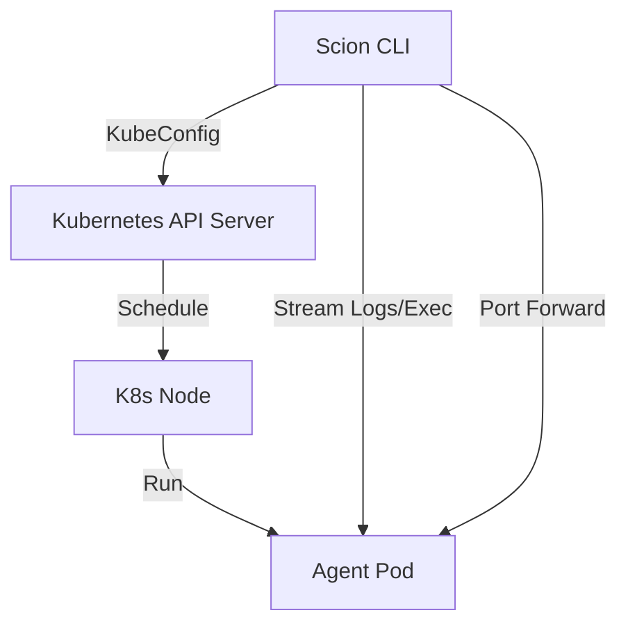

# Kubernetes Runtime Design

## Overview
This document outlines the design for adding a Kubernetes (K8s) runtime to the `scion-agent` CLI. This will allow agents to execute as Pods in a remote or local Kubernetes cluster, enabling scalability, resource management, and isolation superior to local Docker execution.

## Goals
- Allow `scion run` to execute agents in a Kubernetes cluster.
- Maintain a developer experience (DX) as close as possible to the local `docker` runtime.
- Support "Agent Sandbox" technologies for secure execution.
- Solve the challenges of remote file system access and user identity.
- Support a single 'grove' (project) utilizing a mix of local and remote agents.

## Architecture

The `scion` CLI will act as a Kubernetes client, interacting directly with the Kubernetes API (using `client-go`) to manage the lifecycle of agents.



## Key Challenges & Solutions

### 1. The Context Problem (Source Code & Workspace)
In the local `docker` runtime, we bind-mount the project directory. In K8s, the Pod is remote.

#### Solution: Snapshot & Sync (Copy-on-Start)
We will use a "Snapshot" approach for the MVP to align with the "run this task" mental model.
*   **Startup:**
    1.  Create Pod with an `EmptyDir` volume for `/workspace`.
    2.  Wait for Pod to be `Running`.
    3.  `tar` the local directory (respecting `.gitignore`) and stream it to the Pod:
        `tar -cz . | kubectl exec -i <pod> -- tar -xz -C /workspace`
    4.  Start the agent process.

#### Data Synchronization (Sync-Back)
Since the workspace is ephemeral, changes made by the agent must be explicitly retrieved.
*   **Manual Sync:** A new command `scion sync <agent-name>` will stream files from the Pod's `/workspace` back to the local directory.
*   **On Stop:** When `scion stop <agent-name>` is called, the CLI will prompt (or accept a flag `--sync`) to pull changes before destroying the Pod.
    *   *Mechanism:* `kubectl exec -i <pod> -- tar -cz -C /workspace . | tar -xz -C ./local/path`

### 2. The Identity Problem (Home Directory)
#### Solution: Hybrid Secret Projection
*   **Auth:** The CLI will auto-detect critical credentials (e.g., `~/.ssh/id_rsa`, `~/.config/gcloud`) and offer to create ephemeral K8s Secrets to mount them.
*   **Config:** Agents should be configured via environment variables or explicit config files rather than syncing a full home directory.

### 3. Security & Isolation (Agent Sandbox)
#### Solution: K8s agent sandbox
The `KubernetesRuntime` will support a https://github.com/kubernetes-sigs/agent-sandbox - This project is developing a Sandbox Custom Resource Definition (CRD) and controller for Kubernetes. A research note on this is availabe in k8s-agent-sandbox.md in the .design folder of this repo.

## Local Representation & State

Even though agents run remotely, their "handle" must remain local to maintain a consistent CLI experience.

### Directory Structure
We will retain the `.scion/agents/<agent-name>/` directory for every agent, regardless of runtime.

*   **`.scion/agents/<agent-name>/scion.json`**:
    *   **`runtime`**: `"kubernetes"`
    *   **`kubernetes`**: (Read-only metadata)
        *   `cluster`: "my-cluster-context" (Snapshot of the context used to create it)
        *   `namespace`: "scion-agents"
        *   `podName`: "scion-agent-xyz-123"
        *   `syncedAt`: Timestamp of last sync.
*   **`.scion/agents/<agent-name>/pod.yaml`**: The generated Pod specification used to create the agent.

### State Management
*   **Listing:** `scion list` will iterate through `.scion/agents/`. For K8s agents, it will perform a lightweight API check (e.g., `GetPod`) to update the status (Running/Completed/Error).
*   **Orphaned Pods:** If a local agent directory is deleted, the CLI should eventually allow "garbage collection" of managed Pods in the cluster via labels (`managed-by=scion`).

## Grove Configuration

A "Grove" (the current project context) needs to define where its remote agents should live. This configuration can be provided via an optional `kubernetes-config.json` in the project's `.scion/` directory.

### Configuration Schema (`kubernetes-config.json`)

We will rely on the user's standard `~/.kube/config` for authentication and endpoint details, avoiding the need to manage sensitive credentials within Scion itself.

```json
{
  "context": "minikube",        // Optional: specific kubeconfig context to use
  "namespace": "scion-dev",     // Optional: target namespace (default: default)
  "runtimeClassName": "gvisor", // Optional: for sandboxing
  "resources": {                // Optional: default resource requests/limits
    "requests": { "cpu": "500m", "memory": "512Mi" },
    "limits": { "cpu": "2", "memory": "2Gi" }
  }
}
```

## Runtime Selection & Preferences

To ensure maximum flexibility, the choice between `docker` and `kubernetes` runtimes follows a strict resolution hierarchy.

### Resolution Hierarchy (Precedence)
1.  **Command-line Flag:** `scion run --runtime kubernetes` (One-time override).
2.  **Agent State:** `.scion/agents/<name>/scion.json` (Locked to the runtime chosen at creation).
3.  **Template Config:** `templates/<name>/scion.json` (Specific to an agent type/requirement).
4.  **Grove (Project) Preference:** `.scion/settings.json` (Project-wide defaults).
5.  **Global Preference:** `~/.scion/settings.json` (User-wide defaults).
6.  **Default:** `docker`.

### Sticky Runtimes
Once an agent is created, its runtime is **immutable** and stored in its local `scion.json`. Subsequent `start`, `stop`, or `attach` commands will always use the runtime specified in the agent's state, regardless of changes to global or grove settings.

## Implementation Plan

### Initial work completed in phase one 
   1. Dependencies: Added k8s.io/api, k8s.io/apimachinery, and k8s.io/client-go to go.mod.
   2. API Types: Created pkg/k8s/api/v1alpha1/types.go containing the Go struct definitions for Sandbox, SandboxClaim, and SandboxTemplate
      mirroring the Agent Sandbox specification.
   3. Client: Implemented pkg/k8s/client.go, a typed client wrapper using client-go/dynamic to interact with the new CRDs. It also exposes the
      standard Kubernetes clientset and config.
   4. Runtime: Scaffolding the KubernetesRuntime in pkg/runtime/kubernetes/runtime.go, implementing the Runtime interface with initial logic
      for Run, Stop, and Delete.

### Next steps (for future sessions):
   1. Implement the WaitForReady logic in Run to block until the Sandbox is provisioned.
   2. Implement ListSandboxClaims in the client.
   3. Implement the tar streaming logic to sync the local context to the remote Sandbox pod.
   4. Implement Exec logic to start the agent process within the Sandbox.


## Future Work
*   **Sidecar Syncing:** Integrate with tools like Mutagen for real-time bidirectional syncing.
*   **Web Attach:** Provide a web-based gateway/proxy to attach to agents via browser.
*   **Job Mode:** Support running agents as K8s Jobs for finite, non-interactive tasks.